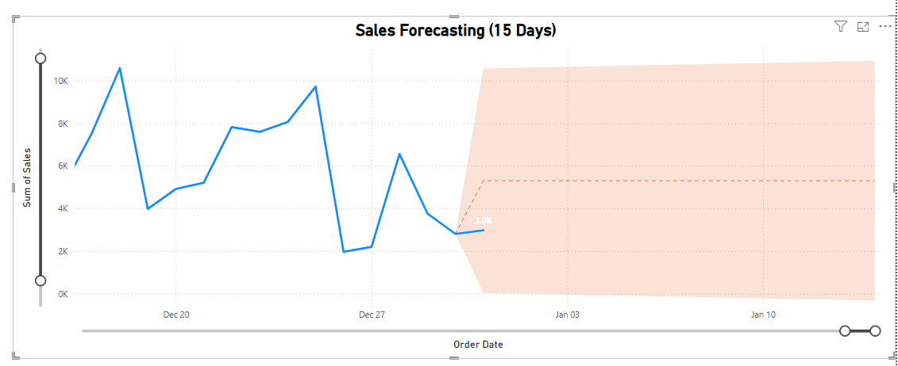

# Super Store Sales Dashboard - Power BI  

## Overview  
This Power BI dashboard provides an interactive visualization of **sales performance** for a retail store in the **United States**. It enables users to analyze key metrics, track trends, and **forecast sales for the next 15 days** based on the past 2 years' sales data.  

## Features  
- **Sales Analysis:** Displaying total sales, quantity, profit, and average shipping days.  
- **Segment-wise Sales:** Breakdown by **Consumer, Corporate, and Home Office**.  
- **Payment Mode Distribution:** Sales split across **Cards, COD, and Online payments**.  
- **Sales by Ship Mode:** Order distribution across different shipping methods.  
- **Month-wise Trends:** **Year-over-Year (YoY)** comparison of sales and profit.  
- **Sales & Profit by State:** **Interactive map visualization** for regional sales insights.  
- **Category & Sub-Category Breakdown:** Highlighting best-performing product categories.  
- **Zone-wise Visualization:** Sales analysis by **Central, East, South, and West zones**.  
- **15-Day Sales Forecasting:** Using Power BI’s forecasting features and DAX functions to predict sales based on the last **2 years' data**.  
- **Data Cleaning & Transformation:** Processed and structured raw data before visualization.  

## Tools & Techniques Used  
- **Power BI**  
- **DAX (Data Analysis Expressions)**  
- **Power Query for Data Cleaning**  
- **Sales Forecasting (Next 15 Days)**  
- **Map Visuals for Geographic Analysis**  
- **Filters & Slicers for Interactive Exploration**  

## How to Use  
1. Open the Power BI file (.pbix).  
2. Use filters to analyze sales **by year, category, and zone**.  
3. Explore the **15-day forecast trends** to plan sales strategies effectively.  

## Screenshots

## License  
This project is for educational and portfolio purposes. Feel free to use or modify it as needed.  
